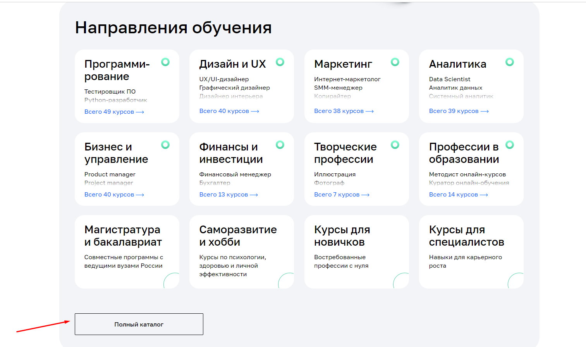
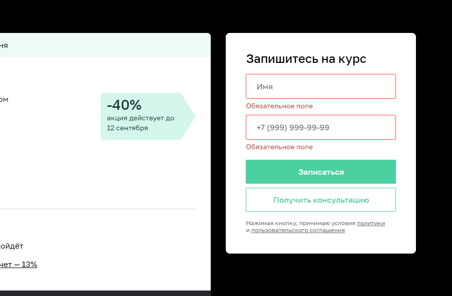
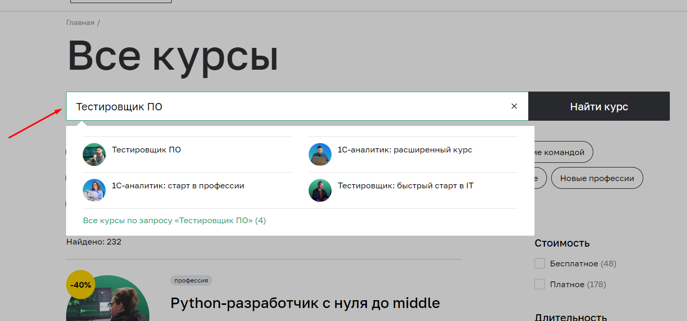
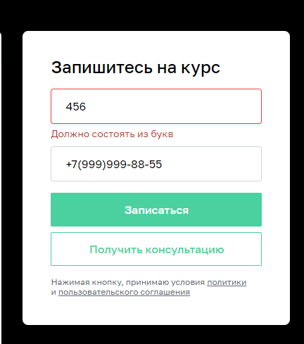
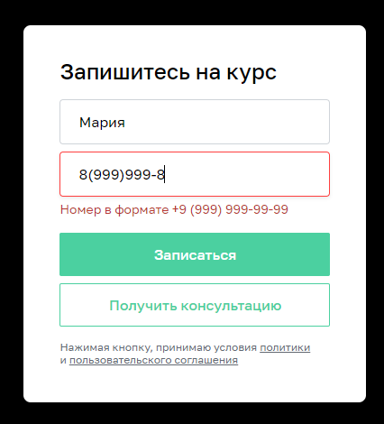

# План автоматизации тестирования сценария перехода к форме записи и заполнения формы на сайте [Нетологии](https://netology.ru/#/)

## 1. Перечень автоматизируемых сценариев:

### Сценарии перехода на страницу профессии "Тестировщик ПО":

#### 1. Переход на страницу профессии "Тестировщик ПО" с помощью меню "Каталог курсов" и строки поиска:

Шаги воспроизведения:

1. На главной странице [Нетологии](https://netology.ru/) нажать на меню "Каталог курсов".
2. В выпадающем меню в поле поиска ввести "Тестировщик ПО".
3. Выбрать из списка профессий "Тестировщик ПО".

*Ожидаемый результат*: Пользователь попадает на страницу профессии "Тестировщик ПО".

#### 2. Переход на страницу профессии "Тестировщик ПО" с помощью меню "Каталог курсов" и подменю "Программирование":

Шаги воспроизведения:

1. На главной странице [Нетологии](https://netology.ru/) нажать на меню "Каталог курсов".
2. Выбрать из списка подменю "Программирование".
3. Выбрать из списка профессий "Тестировщик ПО".

*Ожидаемый результат*: Пользователь попадает на страницу профессии "Тестировщик ПО".

#### 3. Переход на страницу профессии "Тестировщик ПО" с помощью меню "Каталог курсов", выбора подменю "Программирование" и через строку поиска в нем:

Шаги воспроизведения:

1. На главной странице [Нетологии](https://netology.ru/) нажать на меню "Каталог курсов".
2. Выбрать из списка подменю "Программирование".
3. В поле поиска ввести "Тестировщик ПО".

*Ожидаемый результат*: Пользователь попадает на страницу профессии "Тестировщик ПО".

#### 4. Переход на страницу профессии "Тестировщик ПО" с помощью меню "Каталог курсов", подменю "Программирование" и отметки чекбокса "Тестирование ПО":

Шаги воспроизведения:

1. На главной странице [Нетологии](https://netology.ru/) нажать на меню "Каталог курсов", подменю "Программирование".
2. В правой части экрана в подразделе "Навыки" установить галочку в чекбоксе "Тестирование ПО".
3. Выбрать из списка профессию "Тестировщик ПО".

*Ожидаемый результат*: Пользователь попадает на страницу профессии "Тестировщик ПО".

#### 5. Переход на страницу профессии "Тестировщик ПО" с помощью раздела "Направления обучения" и подоаздела "Программирование":

Шаги воспроизведения:

1. На главной странице [Нетологии](https://netology.ru/) в разделе "Направления обучения" нажать на подраздел "Программирование".
2. Выбрать в списке курсов професси. "Тестировщик ПО".

*Ожидаемый результат*: Пользователь попадает на страницу профессии "Тестировщик ПО".\\

#### 6. Переход на страницу профессии "Тестировщик ПО" с помощью раздела "Направления обучения", подраздела "Программирование" и строки поиска в нем:

Шаги воспроизведения:

1. На главной странице [Нетологии](https://netology.ru/) в разделе "Направления обучения" нажать на подраздел "Программирование".
2. В поле поиска ввести "Тестировщик ПО".
3. В списке профессий выбрать профессию "Тестировщик ПО".

*Ожидаемый результат*: Пользователь попадает на страницу профессии "Тестировщик ПО".

#### 7. Переход на страницу профессии "Тестировщик ПО" с помощью раздела "Направления обучения", подраздела "Программирование" и отметки чекбокса в нем:

Шаги воспроизведения:

1. На главной странице [Нетологии](https://netology.ru/) в разделе "Направления обучения" нажать на подраздел "Программирование".
2. Справа в подразделе "Навыки" отметить галочкой чекбокс "Тестирование ПО".
3. В списке профессий выбрать профессию "Тестировщик ПО".

*Ожидаемый результат*: Пользователь попадает на страницу профессии "Тестировщик ПО".

#### 8. Переход на страницу профессии "Тестировщик ПО" с помощью нажатия на подраздел "Полный каталаг" и строки поиска в нем:

Шаги воспроизведения:

1. На главной странице [Нетологии](https://netology.ru/) в разделе "Направления обучения" нажать на подраздел "Полный каталог".
   
2. В поле поиска ввести "Тестировщик ПО".
3. В списке профессий выбрать профессию "Тестировщик ПО".

*Ожидаемый результат*: Пользователь попадает на страницу профессии "Тестировщик ПО".

#### 9. Переход на страницу профессии "Тестировщик ПО" с помощью нажатия на подраздел "Полный каталог" и отметки чекбокса в нем:

Шаги воспроизведения:

1. На главной странице [Нетологии](https://netology.ru/#/) нажать на подраздел "Полный каталог".
2. Справа в подразделе "Навыки" отметить галочкой чекбокс "Тестирование ПО".
3. В списке профессий выбрать профессию "Тестировщик ПО".

*Ожидаемый результат*: Пользователь попадает на страницу професссии "Тестировщик ПО".

### Сценарии перехода к форме записи на курс:

#### 1. Переход к форме записи на курс с помощью кнопки "Записаться":

Шаги воспроизведения:

1. На странице профессии "Тестировщик ПО" в левой нижней части экрана, не выполняя скроллинга, нажать на кнопку "Записаться".
   

*Ожидаемый результат*: Пользователь переходит к форме записи на курс.

#### 2. Переход к форме записи на курс с помощью кнопки "Записаться", которая появляется в правом верхнем углу страницы после скроллинга:

Шаги воспроизведения:

1. На странице профессии "Тестировщик ПО" прокрутить страницу до появления всплывающего подраздела сверху страницы.
2. Нажать на кнопку "Записаться" в правом верхнем углу страницы.

*Ожидаемый результат*: Пользователь переходит к форме записи на курс.

#### 3. Переход к форме записи на курс внизу страницы профессии "Тестировщик ПО":

Шаги воспроизведения:

1. На странице профессии "Тестировщик ПО" прокрутить страницу вниз.
   

*Ожидаемый результат*: Пользователь переходит к форме записи на курс.

### Сценарии заполнения формы записи на курс:

*Валидные входные данные*:

- **Поле "Имя"**: буквы на кириллице, на латинице не менее 2 символов, возможен дефис;
- **Поле "Телефон"**: цифры, номер в формате +7 (999)999-99-99. Номера телефонов с кодом других стран поле тоже принимает. (Например, +1(555)555-55-55, +34(888)888-88-88).
  

*Невалидные входные данные*:

- **Поле "Имя"**: цифры, символы, иероглифы, арабская вязь, пустое поле, 1 буква на кириллице или на латинице;
- **Поле "Телефон"**: буквы, символы, иероглифы, арабская вязь, пустое поле, 1 цифра, 12 цифр.

#### 1. Заполнение формы записи на курс валидными данными:

Шаги воспроизведения:

1. Открыть форму записи на курс.
2. Заполнить поля валидными данными.

*Ожидаемый результат*: Пользователь успешно записался на курс. Появилось сообщение: "Вы успешно записали на курс. Скоро наш менеджер свяжется с вами".

#### 2. Заполнение поля "Имя" в форме записи на курс невалидными данными:

Шаги воспроизведения:

1. Открыть форму записи на курс.
2. Заполнить поле "Имя" невалидными данными.
3. Поле "Телефон" заполнить валидными данными.

*Ожидаемый результат*: Пользовать не может записаться на курс. Появляется сообщение под полем "Имя": "Должно состоять из букв".

#### 3. Заполнение поля "Телефон" в форме записи на курс невалидными данными:

Шаги воспроизведения:

1. Открыть форму записи на курс.
2. Заполнить поле "Телефон" невалидными данными.
3. Поле "Имя" заполнить валидными данными.

*Ожидаемый результат*: Пользователь не может записаться на курс. Появляется сообщение под полем "Телефон": "Номер в формате +9(999)999-99-99".

### Тестирование граничных значений:

Форма должна приниматься только в том случае, если выполняется условие min <= a >= max (где a - значение, вводимое в поле).
В иных случаях, ввод должен сопровождаться предупреждением о невозможности отправки формы с таким содержанием.

- значение "0";
- значение "min - 1";
- значение "min";
- значение "min + 1";
- значение "max - 1";
- значение "max";
- значение "max + 1".

***

## 2. Перечень используемых инструментов с обоснованием выбора:

1. Язык программирования Java 11, платформы для написания автотестов и их запуска JUnit4, JUnit5, TestNG + фреймворки Selenide / Selenium - все это отлично подойдет в качестве инструментов для работы.
2. Maven или Gradle - как системы управления проектами, помогут правильно их организовать.
3. Среда разработки IntelliJ IDEA.
4. Для генерации тестовых данных планируется использовать фреймворк Faker, поэтому доступ к базе данных не потребуется.
5. Фреймворк Lombok поможет быстрее разобраться в логах и понять в чем может быть ошибки теста/продукта (сайта).
6. Appveyor поможет всей команде быть в курсе процесса работы тестов.
7. Git - распределенная система управления версиями. Позволяет отслеживать любые изменения файлов, хранить их версию, оперативно возвращаться в любое сохраненное состояние.
8. GitHub - сервис для совместной разработки и хостинга проекта. С помощью этого сервиса над кодом проекта может работать неограниченное число людей из любой точки мира.

***

## 3. Перечень необходимых разрешений, данных и доступов:

1. Разрешение на выполнение автоматизированного тестирования сайта от владельца сайта.
2. Доступ к базе данных и к API сайта.
3. Доступ к документации (требованиям, спефицикациям).

***

## 4. Перечень и описание возможных рисков при автоматизации:

1. Отсутствие необходимых разрешений и доступов.
2. Отсутствие необходимых текстовых меток для поиска локаторов, что увеличивает время на разработку тестов.
3. Изменение структуры сайта в ходе выполнения проекта приводит к уточнению локаторов.
4. Технический сбой.
5. Дополнительные затраты - на разработку тестов, поддержку, запуск и т.д.
6. Сложность сравнения результатов - ожидаемый/фактический.
7. Повышение требований к уровню тестировщика.

***

## 5. Перечень необходимых специалистов для автоматизации:

Инженер по автоматизированному тестированию.

***

## 6. Интервальная оценка с учетом риска в часах:

С учетом всех рисков на начальном этапе необходим 1 автотестировщик. Один такой специалист может справиться с поставленным объемом работы, например за 3 рабочих дня (24 часа). 
Далее, нужно поддерживать тесты, адаптировать код под изменения, вносимые в проект.

