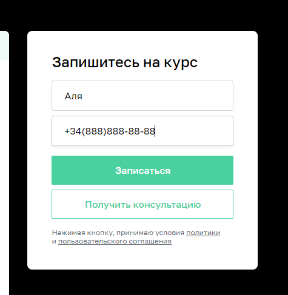

# План автоматизации тестирования сценария перехода к форме записи и заполнения формы на сайте [Нетологии](https://netology.ru/#/)

***Что мы хотим запланировать:*** тестирование возможности записаться на обучение профессии "Тестировщик ПО".

## Шаг 1

Перед тем как начать тестирование эту форму записи на обучение, необходимо перейти на страницу Профессии.
Это сделать можно следующими способами:

**Способ 1**

1. Перейти на сайт [Нетологии](https://netology.ru/).
2. Нажать на кнопку "Каталог курсов".

3. В разделе "Направления обучения" выбрать "Программирование".
4.[README.md](README.md) Далее, нажать на профессию "Тестировщик ПО".
5. Выполняется переход на страницу профессии ["Тестировщик ПО"](https://netology.ru/programs/qa).

**Способ 2**

1. Перейти на сайт [Нетологии](https://netology.ru/).
2. В разделе "Направления обучения" выбрать блок "Программирование".

3. Выполняется переход на страницу ["Программирование"](https://netology.ru/development).
4. Выбираем профессию "Тестировщик ПО".
5. Выполняется переход на страницу профессии ["Тестировщик ПО"](https://netology.ru/programs/qa).

**Способ 3**

1. Перейти на сайт [Нетологии](https://netology.ru/).
2. Прокрутить страницу вниз.
3. Нажать на кнопку "Полный каталог".

4. В строке поиска ввести название профессии "Тестировщик ПО".

5. Выбрать профессию "Тестировщик ПО".
6. Выполняется переход на страницу профессии ["Тестировщик ПО"](https://netology.ru/programs/qa).

**Способ 4**

1. Перейти на сайт [Нетологии](https://netology.ru/).
2. Нажать на кнопку "НЕО для начинающих".
3. Нажать на "Тестировщик ПО".
4. Выполняется переход на страницу профессии ["Тестировщик ПО"](https://netology.ru/programs/qa).

## Шаг 2

Страница найдена. Теперь нужно найти форму записи на обучение. Есть несколько способов:

**Способ 1**

Нажать на кнопку "Записаться" в левой нижней части экрана, не выполняя скроллинга

**Способ 2**

Выполнить скроллинг до раздела "Запишитесь на курс"

## Шаг 3

Форма найдена. Необходимо протестировать поля, проверить выполняются ли требования для полей

***Позитивное тестирование:***

Поле **"Имя":**

1. Принимает только кириллицу.
2. Принимает только 1 символ "-".
3. Имеет ограничения по вводу символов (от 2 (min) и до (например) 25 ).

Поле **"Номер телефона":**

1. Принимает только цифры.
2. Принимает только 11 (max) символов.

***Негативное тестирование:***

Ввод указанных ниже значений должен сопровождаться предупреждением о невозможности отправки формы с таким содержанием:

- латинские буквы a-z, иероглифы, арабская вязь;
- цифры;
- спецсимволы;
- различная кодировка, кроме UTF-8;
- скрипты;
- HTML-теги;
- пробелы;
- ссылки;

***Тестирование граничных значений:***

Форма должна приниматься только в том случае, если выполняется условие min <= a >= max (где a - значение, вводимое в поле).
В иных случаях, ввод должен сопровождаться предупреждением о невозможности отправки формы с таким содержанием.

- значение "0";
- значение "min - 1";
- значение "min";
- значение "min + 1";
- значение "max - 1";
- значение "max";
- значение "max + 1".

### Промежуточные итоги:

Были описаны возможные сценарии для выполнения тестирования отправки формы для записи на обучение по профессии "Тестировщик ПО" с момента перехода с главной страницы сайта и до момента нажатия на кнопку "Записаться".
Нетология предоставляет возможность обучаться на более чем 250 курсах.

Тестирование однотипных повторяющихся действий в таком объеме может значительно снизить стимул сотрудников QA, это также может повлиять на качество их работы и привести к текучке кадров.

Решить эту проблему поможет автоматизированное тестирование. Для этого стоит реализовать приведенные выше сценарии (написав код), задать входные параметры - ссылки на все курсы Нетологии, чтобы вся работа выполнялась автоматически.

Кроме того, благодаря автоматизации могут быть получены следующие результаты:

- Сокращение стоимости тестирования;
- Сокращение времени тестирования;
- Увеличение покрытия тестирования;
- Увеличение частоты тестирования;
- Исключение человеческого фактора;
- Быстрая обратная связь.

**Что планируется использовать для автоматизации (инструменты)?:**
1. Язык программирования Java 11, платформы для написания автотестов и их запуска JUnit4, JUnit5, TestNG + фреймворки Selenide / Selenium - все это отлично подойдет в качестве инструментов для работы.
2. Maven или Gradle - как системы управления проектами, помогут правильно их организовать.
3. Среда разработки IntelliJ IDEA.
4. Для генерации тестовых данных планируется использовать фреймворк Faker, поэтому доступ к базе данных не потребуется.
5. Фреймворк Lombok поможет быстрее разобраться в логах и понять в чем может быть ошибки теста/продукта (сайта).
6. Для контроля версий необходимы Git + GitHub.
7. Appveyor поможет всей команде быть в курсе процесса работы тестов.

**Какие нужны доступы?**

Безопасность некоторых сайтов, в т.ч. сайта Нетологии, запрещает проводить автоматизированное тестирование. Нам могут предоставить какие-то анонимные данные, а могут и нет.

**Какие существуют риски?**

- Дополнительные затраты - на разработку тестов, поддержку тестов, запуск и т.д.;
- Повышение требований к уровню тестировщиков;
- Сложность сравнения результатов - ожидаемый/фактический.

**Кто будет проводить автоматизацию?**

Для написания грамотных автотестов нужен специалист, знающий не только язык программирования Java, но и также умеющий писать автотесты на этом языке. Он также должен знать и уметь применять в своей работе все вышеуказанные инструменты.

**Интервальная оценка**

С учетом всех рисков на начальном этапе необходим 1 автотестировщик. Один такой специались может справиться с поставленным объемом работы, например за 3 рабочих дня (24 часа). Но это не значит, что как только он выполнит свою работу по написанию автотестов, ему нечего больше будет делать. Ему нужно поддерживать, адаптировать код под изменения, вносимые в проект.

Для автоматизации всего проекта понадобится уже больше специалистов. Можно пригласить в команду специалистов, не имеющих коммерческого опыта, чтобы обучить их непосредственно под проект.
Это снизит первоначальные затраты на сорудников, но при этом обеспечит команду высококвалифицированными специалистами под проект.

